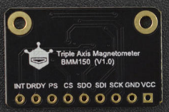

# DFRobot_bmm150

* [中文](./README_CN.md)

This RaspberryPi BMM150 sensor board can communicate with RaspberryPi via I2C or spi.<br>
The BMM150 is capable of obtaining triaxial geomagnetic data.<br>



## Product Link（[https://www.dfrobot.com.cn/](https://www.dfrobot.com.cn/)）
    SKU：SEN0419

## Table of Contents

* [Summary](#summary)
* [Installation](#installation)
* [Methods](#methods)
* [History](#history)
* [Credits](#credits)

## Summary

Get geomagnetic data along the XYZ axis.

1. This module can obtain high threshold and low threshold geomagnetic data. <br>
2. Geomagnetism on three(xyz) axes can be measured.<br>
3. This module can choose I2C or SPI communication mode.<br>


## Installation

This Sensor should work with DFRobot_BMM150 on RaspberryPi. <br>
Run the program:

```
$> python data_ready_interrupt.py
$> python threshold_interrupt.py
$> python get_geomagnetic_data.py
$> python get_all_state.py
```

## Methods

```python
  '''!
    @brief Init bmm150 check whether the chip id is right
    @return 0  is init success
            -1 is init failed
  '''
  def sensor_init(self):

  '''!
    @brief get bmm150 chip id
    @return chip id
  '''
  def get_chip_id(self):

  '''!
    @brief Soft reset, restore to suspend mode after soft reset and then enter sleep mode, soft reset can't be implemented under suspend mode
  '''
  def soft_reset(self):

  '''!
    @brief Sensor self test, the returned character string indicate the self test result.
    @return The character string of the test result
  '''
  def self_test(self):

  '''!
    @brief Enable or disable power
    @param ctrl is enable/disable power
    @n DISABLE_POWER is disable power
    @n ENABLE_POWER  is enable power
  '''
  def set_power_bit(self, ctrl):

  '''!
    @brief Get the power state
    @return power state
    @n DISABLE_POWER is disable power
    @n ENABLE_POWER  is enable power
  '''
  def get_power_bit(self):

  '''!
    @brief Set sensor operation mode
    @param modes
    @n POWERMODE_NORMAL       normal mode  Get geomagnetic data normally
    @n POWERMODE_FORCED       forced mode  Single measurement, the sensor restores to sleep mode when the measurement is done.
    @n POWERMODE_SLEEP        sleep mode   Users can visit all the registers, but can't measure geomagnetic data
    @n POWERMODE_SUSPEND      suspend mode Users can only visit the content of the control register BMM150_REG_POWER_CONTROL
  '''
  def set_operation_mode(self, modes):

  '''!
    @brief Get sensor operation mode
    @return Return the character string of the operation mode
  '''
  def get_operation_mode(self):

  '''!
    @brief Set the rate of obtaining geomagnetic data, the higher, the faster (without delay function)
    @param rate
    @n RATE_02HZ
    @n RATE_06HZ
    @n RATE_08HZ
    @n RATE_10HZ        #(default rate)
    @n RATE_15HZ
    @n RATE_20HZ
    @n RATE_25HZ
    @n RATE_30HZ
  '''
  def set_rate(self, rates):

  '''!
    @brief Get the config data rate, unit: HZ
    @return rate
  '''
  def get_rate(self):

  '''!
    @brief Set preset mode, make it easier for users to configure sensor to get geomagnetic data
    @param modes 
    @n PRESETMODE_LOWPOWER       Low power mode, get a small number of data and take the mean value.
    @n PRESETMODE_REGULAR        Regular mode, get a number of data and take the mean value.
    @n PRESETMODE_ENHANCED       Enhanced mode, get a large number of and take the mean value.
    @n PRESETMODE_HIGHACCURACY   High accuracy mode, get a huge number of data and take the mean value.
  '''
  def set_preset_mode(self, modes):

  '''!
    @brief the number of repetitions for x/y-axis
    @param modes
    @n PRESETMODE_LOWPOWER      Low power mode, get the data with lower power.
    @n PRESETMODE_REGULAR       Normal mode, get the data normally
    @n PRESETMODE_HIGHACCURACY  High accuracy mode, get the data with higher accuracy
    @n PRESETMODE_ENHANCED      Enhanced mode, get the data with higher accuracy than under high accuracy mode
  '''
  def set_xy_rep(self, modes):

  '''!
    @brief the number of repetitions for z-axis
    @param modes
    @n PRESETMODE_LOWPOWER      Low power mode, get the data with lower power.
    @n PRESETMODE_REGULAR       Normal mode, get the data normally
    @n PRESETMODE_HIGHACCURACY  High accuracy mode, get the data with higher accuracy
    @n PRESETMODE_ENHANCED      Enhanced mode, get the data with higher accuracy than under high accuracy mode
  '''
  def set_z_rep(self, modes):

  '''!
    @brief Get bmm150 reserved data information, which is used for data compensation
  '''
  def get_trim_data(self):

  '''!
    @brief Get the geomagnetic data of 3 axis (x, y, z)
    @return The list of the geomagnetic data at 3 axis (x, y, z) unit: uT
    @       [0] The geomagnetic data at x-axis
    @       [1] The geomagnetic data at y-axis
    @       [2] The geomagnetic data at z-axis
  '''
  def get_geomagnetic(self):

  '''!
    @brief Get the geomagnetic data of 3 axis (x, y, z)
    @return The list of the geomagnetic data at 3 axis (x, y, z) unit: uT
    @       [0] The geomagnetic data at x-axis (float)
    @       [1] The geomagnetic data at y-axis (float)
    @       [2] The geomagnetic data at z-axis (float)
  '''
  def get_f_geomagnetic(self):

  '''!
    @brief Get compass degree
    @return Compass degree (0° - 360°)  0° = North, 90° = East, 180° = South, 270° = West.
  '''
  def get_compass_degree(self):

  '''!
    @brief uint8_t to int8_t
    @param number    uint8_t data to be transformed
    @return number   The transformed data
  '''
  def uint8_to_int8(self, number):

  '''!
    @berif Compensate the geomagnetic data at x-axis
    @param  data_x       The raw geomagnetic data
    @param  data_r       The compensated data
    @return retval       The calibrated geomagnetic data
  '''
  def compenstate_x(self, data_x, data_r):

  '''!
    @berif Compensate the geomagnetic data at y-axis
    @param  data_y       The raw geomagnetic data
    @param  data_r       The compensated data
    @return retval       The calibrated geomagnetic data
  '''
  def compenstate_y(self, data_y, data_r):

  '''!
    @berif Compensate the geomagnetic data at z-axis
    @param  data_z       The raw geomagnetic data
    @param  data_r       The compensated data
    @return retval       The calibrated geomagnetic data
  '''
  def compenstate_z(self, data_z, data_r):

  '''!
    @brief Enable or disable data ready interrupt pin
    @n     After enabling, the pin DRDY signal jump when there's data coming.
    @n     After disabling, the pin DRDY signal does not jump when there's data coming.
    @n     High polarity: active on high, the default is low level, which turns to high level when the interrupt is triggered.
    @n     Low polarity: active on low, the default is high level, which turns to low level when the interrupt is triggered.
    @param modes
    @n   DRDY_ENABLE      Enable DRDY
    @n   DRDY_DISABLE     Disable DRDY
    @param polarity
    @n   POLARITY_HIGH    High polarity
    @n   POLARITY_LOW     Low polarity
  '''
  def set_data_ready_pin(self, modes, polarity):

  '''!
    @brief Get data ready status, determine whether the data is ready
    @return status
    @n 1 is   data is ready
    @n 0 is   data is not ready
  '''
  def get_data_ready_state(self):

  '''!
    @brief Enable the measurement at x-axis, y-axis and z-axis, default to be enabled, no config required. When disabled, the geomagnetic data at x, y, and z will be inaccurate.
    @param channel_x
    @n MEASUREMENT_X_ENABLE     Enable the measurement at x-axis
    @n MEASUREMENT_X_DISABLE    Disable the measurement at x-axis
    @param channel_y
    @n MEASUREMENT_Y_ENABLE     Enable the measurement at y-axis
    @n MEASUREMENT_Y_DISABLE    Disable the measurement at y-axis
    @param channel_z
    @n MEASUREMENT_Z_ENABLE     Enable the measurement at z-axis
    @n MEASUREMENT_Z_DISABLE    Disable the measurement at z-axis
  '''
  def set_measurement_xyz(self, channel_x = MEASUREMENT_X_ENABLE, channel_y = MEASUREMENT_Y_ENABLE, channel_z = MEASUREMENT_Z_ENABLE):

  '''!
    @brief Get the enabling status at x-axis, y-axis and z-axis
    @return Return enabling status at x-axis, y-axis and z-axis as a character string
  '''
  def get_measurement_xyz_state(self):

  '''!
    @brief Enable or disable INT interrupt pin
    @n     Enabling pin will trigger interrupt pin INT level jump
    @n     After disabling pin, INT interrupt pin will not have level jump
    @n     High polarity: active on high, the default is low level, which turns to high level when the interrupt is triggered.
    @n     Low polarity: active on low, the default is high level, which turns to low level when the interrupt is triggered.
    @param modes
    @n     ENABLE_INTERRUPT_PIN     Enable interrupt pin
    @n     DISABLE_INTERRUPT_PIN    Disable interrupt pin
    @param polarity
    @n     POLARITY_HIGH            High polarity
    @n     POLARITY_LOW             Low polarity
  '''
  def set_interrupt_pin(self, modes, polarity):

  '''!
    @brief Set interrupt latch mode, after enabling interrupt latch, the data can be refreshed only when the BMM150_REG_INTERRUPT_STATUS interrupt status register is read.
    @n   Disable interrupt latch, data update in real-time
    @param modes
    @n  INTERRUPUT_LATCH_ENABLE         Enable interrupt latch
    @n  INTERRUPUT_LATCH_DISABLE        Disable interrupt latch
  '''
  def set_interruput_latch(self, modes):

  '''!
    @brief Set threshold interrupt, an interrupt is triggered when the geomagnetic value of a channel is beyond/below the threshold
    @n      High polarity: active on high, the default is low level, which turns to high level when the interrupt is triggered.
    @n      Low polarity: active on low, the default is high level, which turns to low level when the interrupt is triggered.
    @param modes
    @n     LOW_THRESHOLD_INTERRUPT     Low threshold interrupt mode
    @n     HIGH_THRESHOLD_INTERRUPT    High threshold interrupt mode
    @param threshold
    @n Threshold, default to expand 16 times, for example: under low threshold mode, if the threshold is set to be 1, actually the geomagnetic data below 16 will trigger an interrupt
    @param polarity
    @n POLARITY_HIGH               High polarity
    @n POLARITY_LOW                Low polarity
    @param channel_x
    @n INTERRUPT_X_ENABLE          Enable low threshold interrupt at x-axis
    @n INTERRUPT_X_DISABLE         Disable low threshold interrupt at x-axis
    @param channel_y
    @n INTERRUPT_Y_ENABLE          Enable low threshold interrupt at y-axis
    @n INTERRUPT_Y_DISABLE         Disable low threshold interrupt at y-axis
    @param channel_z
    @n INTERRUPT_Z_ENABLE          Enable low threshold interrupt at z-axis
    @n INTERRUPT_Z_DISABLE         Disable low threshold interrupt at z-axis
  '''
  def set_threshold_interrupt(self, mode, threshold, polarity, channel_x = INTERRUPT_X_ENABLE, channel_y = INTERRUPT_Y_ENABLE, channel_z = INTERRUPT_Z_ENABLE):

  '''!
    @brief Get the data that threshold interrupt occured
    @return Return the list for storing geomagnetic data, how the data at 3 axis influence interrupt status,
    @n      [0] The data triggering threshold at x-axis, when the data is NO_DATA, the interrupt is triggered.
    @n      [1] The data triggering threshold at y-axis, when the data is NO_DATA, the interrupt is triggered.
    @n      [2] The data triggering threshold at z-axis, when the data is NO_DATA, the interrupt is triggered.
    @n      [3] The character string storing the trigger threshold interrupt status
    @n      [4] The binary data format of storing threshold interrupt status are as follows
    @n         bit0 is 1 indicate threshold interrupt is triggered at x-axis
    @n         bit1 is 1 indicate threshold interrupt is triggered at y-axis
    @n         bit2 is 1 indicate threshold interrupt is triggered at z-axis
    @n         ------------------------------------
    @n         | bit7 ~ bit3 | bit2 | bit1 | bit0 |
    @n         ------------------------------------
    @n         |  reserved   |  0   |  0   |  0   |
    @n         ------------------------------------
  '''
  def get_threshold_interrupt_data(self):
```

## History

- 2023/08/16 - Version 1.0.1 released.
- 2021/04/21 - Version 1.0.0 released.

## Credits

Written by ZhixinLiu(zhixin.liu@dfrobot.com), 2021. (Welcome to our website)
