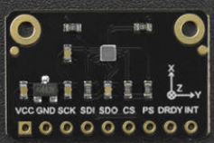
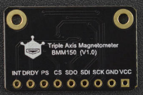

# DFRobot_bmm150

- [English Version](./README.md)

BMM150 是一款低功耗、低噪声的 3 轴数字地磁传感器，完全符合罗盘应用的要求。 基于博世专有的 FlipCore 技术，BMM150 提供了高精度和动态的绝对空间方向和运动矢量。 体积小、重量轻，特别适用于支持无人机精准航向。 BMM150 还可与由 3 轴加速度计和 3 轴陀螺仪组成的惯性测量单元一起使用。




## 产品链接（[https://www.dfrobot.com.cn/goods-3420.html](https://www.dfrobot.com.cn/goods-3420.html)）
    SKU: SEN0419 

## 目录

  * [概述](#概述)
  * [库安装](#库安装)
  * [方法](#方法)
  * [兼容性](#兼容性)
  * [历史](#历史)
  * [创作者](#创作者)

## 概述

您可以沿 XYZ 轴获取地磁数据

1. 本模块可以获得高阈值和低阈值地磁数据。 <br>
2. 可以测量三个（xyz）轴上的地磁。<br>
3. 本模块可选择I2C或SPI通讯方式。<br> 


## 库安装
1. 下载库至树莓派，要使用这个库，首先要将库下载到Raspberry Pi，命令下载方法如下:<br>
```python
sudo git clone https://github.com/DFRobot/DFRobot_BMM150
```
2. 打开并运行例程，要执行一个例程demo_x.py，请在命令行中输入python demo_x.py。例如，要执行data_ready_interrupt.py例程，你需要输入:<br>

```python
python data_ready_interrupt.py 
或 
python2 data_ready_interrupt.py 
或 
python3 data_ready_interrupt.py
```

## 方法

```python
  '''!
    @brief 初始化bmm150 判断芯片id是否正确
    @return 0  is init success
    @n      -1 is init failed
  '''
  def sensor_init(self):

  '''!
    @brief 软件复位，软件复位后先恢复为挂起模式，而后恢复为睡眠模式,suspend mode下不能软件复位
  '''
  def soft_reset(self):

  '''!
    @brief 传感器自测，返回字符串表明自检结果
    @return 测试结果的字符串
  '''
  def self_test(self):

  '''!
    @brief 设置传感器的执行模式
    @param modes
    @n     POWERMODE_NORMAL       normal mode  正常的获得地磁数据的模式
    @n     POWERMODE_FORCED       forced mode  单次测量，测量完成后，传感器恢复sleep mode
    @n     POWERMODE_SLEEP        sleep mode   用户可以访问所有寄存器，不能测量地磁数据
    @n     POWERMODE_SUSPEND      suspend mode 用户只能访问控制寄存器 BMM150_REG_POWER_CONTROL的内容
  '''
  def set_operation_mode(self, modes):

  '''!
    @brief 获取传感器的执行模式
    @return 返回模式的字符串
  '''
  def get_operation_mode(self):

  '''!
    @brief 设置地磁数据获取的速率，速率越大获取越快(不加延时函数)
    @param rate
    @n     RATE_02HZ
    @n     RATE_06HZ
    @n     RATE_08HZ
    @n     RATE_10HZ        #(default rate)
    @n     RATE_15HZ
    @n     RATE_20HZ
    @n     RATE_25HZ
    @n     RATE_30HZ
  '''
  def set_rate(self, rates):

  '''!
    @brief 获取配置的数据速率 单位：HZ
    @return rate
  '''
  def get_rate(self):

  '''!
    @brief 设置预置模式，使用户更简单的配置传感器来获取地磁数据
    @param modes 
    @n     PRESETMODE_LOWPOWER       低功率模式,获取少量的数据 取均值
    @n     PRESETMODE_REGULAR        普通模式,获取中量数据 取均值
    @n     PRESETMODE_ENHANCED       增强模式,获取大量数据 取均值
    @n     PRESETMODE_HIGHACCURACY   高精度模式,获取超大量数据 取均值
  '''
  def set_preset_mode(self, modes):

  '''!
    @brief 获取x y z 三轴的地磁数据
    @return x y z 三轴的地磁数据的列表 单位：微特斯拉（uT）
    @n      [0] x 轴地磁的数据
    @n      [1] y 轴地磁的数据
    @n      [2] z 轴地磁的数据
  '''
  def get_geomagnetic(self):


  '''!
    @brief 获取x y z 三轴的地磁数据 浮点型数据
    @return x y z 三轴的地磁数据的列表 单位：微特斯拉（uT）
    @n      [0] x 轴地磁的数据
    @n      [1] y 轴地磁的数据
    @n      [2] z 轴地磁的数据
  '''
  def get_f_geomagnetic(self):

  '''!
    @brief 获取罗盘方向
    @return 罗盘方向 (0° - 360°)  0° = North, 90° = East, 180° = South, 270° = West.
  '''
  def get_compass_degree(self):

  '''!
    @brief 使能或者禁止数据准备中断引脚
    @n     使能后有数据来临DRDY引脚跳变
    @n     禁止后有数据来临DRDY不进行跳变
    @n     高极性：高电平为活动电平，默认为低电平，触发中断时电平变为高
    @n     低极性：低电平为活动电平，默认为高电平，触发中断时电平变为低
    @param modes
    @n     DRDY_ENABLE      使能DRDY
    @n     DRDY_DISABLE     禁止DRDY
    @param polarity
    @n     POLARITY_HIGH    高极性
    @n     POLARITY_LOW     低极性
  '''
  def set_data_ready_pin(self, modes, polarity):

  '''!
    @brief 获取数据准备的状态，用来判断数据是否准备好
    @return status
    @n      1 is   data is ready
    @n      0 is   data is not ready
  '''

  '''!
    @brief 使能x y z 轴的测量，默认设置为使能不需要配置，禁止后xyz轴的地磁数据不准确
    @param channel_x
    @n     MEASUREMENT_X_ENABLE     使能 x 轴的测量
    @n     MEASUREMENT_X_DISABLE    禁止 x 轴的测量
    @param channel_y
    @n     MEASUREMENT_Y_ENABLE     使能 y 轴的测量
    @n     MEASUREMENT_Y_DISABLE    禁止 y 轴的测量
    @param channel_z
    @n     MEASUREMENT_Z_ENABLE     使能 z 轴的测量
    @n     MEASUREMENT_Z_DISABLE    禁止 z 轴的测量
  '''
  def set_measurement_xyz(self, channel_x = MEASUREMENT_X_ENABLE, channel_y = MEASUREMENT_Y_ENABLE, channel_z = MEASUREMENT_Z_ENABLE):

  '''!
    @brief 获取 x y z 轴的使能状态
    @return 返回xyz 轴的使能状态的字符串
  '''
  def get_measurement_xyz_state(self):

  '''!
    @brief 使能或者禁止 INT 中断引脚
    @n     使能引脚后会触发中断引脚 INT 的电平跳变
    @n     禁止引脚后 INT 中断引脚不会发生电平的跳变
    @n     高极性：高电平为活动电平，默认为低电平，触发中断时电平变为高
    @n     低极性：低电平为活动电平，默认为高电平，触发中断时电平变为低
    @param modes
    @n     ENABLE_INTERRUPT_PIN     使能中断引脚
    @n     DISABLE_INTERRUPT_PIN    禁止中断引脚
    @param polarity
    @n     POLARITY_HIGH            高极性
    @n     POLARITY_LOW             低极性
  '''
  def set_interrupt_pin(self, modes, polarity):

  '''!
    @brief 设置阈值中断，当某个通道的地磁值高/低于阈值时触发中断
    @n     高极性：高电平为活动电平，默认为低电平，触发中断时电平变为高
    @n     低极性：低电平为活动电平，默认为高电平，触发中断时电平变为低
    @param modes
    @n     LOW_THRESHOLD_INTERRUPT     低阈值中断模式
    @n     HIGH_THRESHOLD_INTERRUPT    高阈值中断模式
    @param threshold  阈值，默认扩大16倍，例如：低阈值模式下传入阈值1，实际低于16的地磁数据都会触发中断
    @param polarity
    @n     POLARITY_HIGH               高极性
    @n     POLARITY_LOW                低极性
    @param channel_x
    @      INTERRUPT_X_ENABLE          使能 x 轴低阈值中断
    @      INTERRUPT_X_DISABLE         禁止 x 轴低阈值中断
    @param channel_y
    @n     INTERRUPT_Y_ENABLE          使能 y 轴低阈值中断
    @n     INTERRUPT_Y_DISABLE         禁止 y 轴低阈值中断
    @param channel_z
    @n     INTERRUPT_Z_ENABLE          使能 z 轴低阈值中断
    @n     INTERRUPT_Z_DISABLE         禁止 z 轴低阈值中断
  '''
  def set_threshold_interrupt(self, mode, threshold, polarity, channel_x = INTERRUPT_X_ENABLE, channel_y = INTERRUPT_Y_ENABLE, channel_z = INTERRUPT_Z_ENABLE):

  '''!
    @brief 获取发生阈值中断的数据
    @return 返回存放地磁数据的列表，列表三轴当数据和中断状态，
    @n      [0] x 轴触发阈值的数据 ，当数据为NO_DATA时为触发中断
    @n      [1] y 轴触发阈值的数据 ，当数据为NO_DATA时为触发中断
    @n      [2] z 轴触发阈值的数据 ，当数据为NO_DATA时为触发中断
    @n      [3] 存放触发阈值中断状态的字符串
    @n      [4] 存放阈值中断的状态的二进制数据格式，如下
    @n         bit0 is 1 代表x轴触发了阈值中断
    @n         bit1 is 1 代表y轴触发了阈值中断
    @n         bit2 is 1 代表z轴触发了阈值中断
    @n         ------------------------------------
    @n         | bit7 ~ bit3 | bit2 | bit1 | bit0 |
    @n         ------------------------------------
    @n         |  reserved   |  0   |  0   |  0   |
    @n         ------------------------------------
  '''
  def get_threshold_interrupt_data(self):
```

## 兼容性

| 主板         | 通过 | 未通过 | 未测试 | 备注 |
| ------------ | :--: | :----: | :----: | :--: |
| RaspberryPi2 |      |        |   √    |      |
| RaspberryPi3 |      |        |   √    |      |
| RaspberryPi4 |  √   |        |        |      |

* Python 版本

| Python  | 通过 | 未通过 | 未测试 | 备注 |
| ------- | :--: | :----: | :----: | ---- |
| Python2 |  √   |        |        |      |
| Python3 |  √   |        |        |      |

## 历史

- 2023/08/16 - 1.0.1 版本
- 2021/04/21 - 1.0.0 版本

## 创作者

Written by ZhixinLiu(zhixin.liu@dfrobot.com), 2021. (Welcome to our [website](https://www.dfrobot.com/))


